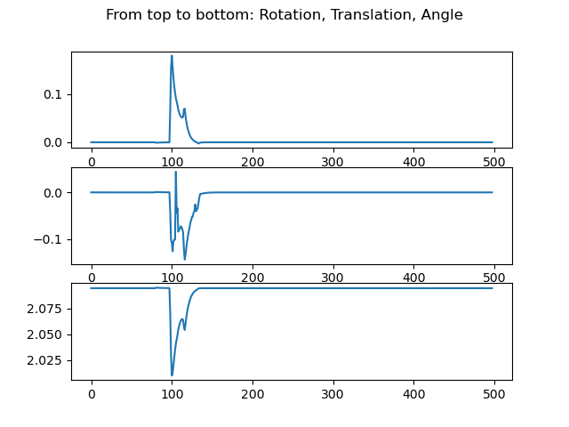
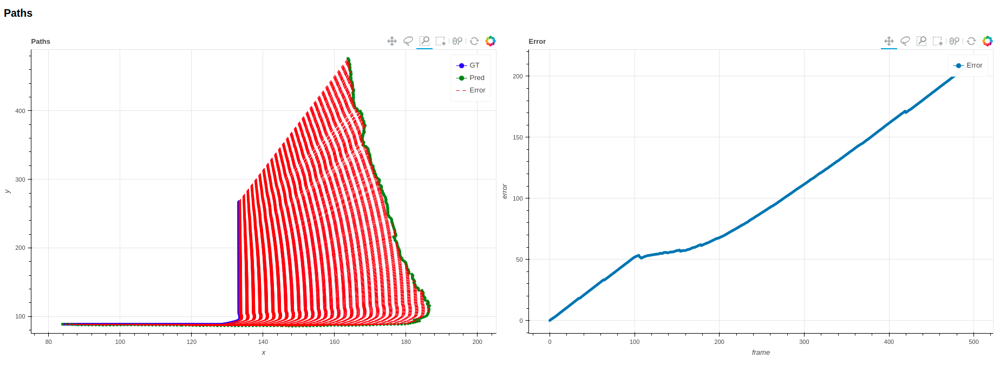

# Visual Odometry

A project that uses the CARLA simulator to make poste estimation via visual odometry.





### Dependencies 
 * google   ``` pip install google ```
 * bokeh    ``` pip install bokeh ```
 * open3d   ``` pip install open3d ```
 * opencv   ``` pip install opencv-python ```
## Usage

You can run the file in two modes: 

Mode1: Lets you drive through the whole scenario from frame start to frame end. You can run it as:

``` python visodom.py --start=5 --end=50``` to get results of each consecutive frame between 5 and 50

Mode2: Lets you compare two images. For this, simply set the --singleframe flag to true. Start and End will then define the two frames 

``` python visodom.py --start=5 --end=50 --singleframe=True``` will compare the frames 5 and 50 with each other

As default the ```one_weather/episode_000/``` is delivered with this repository. To use another episode, link it with the --datadir flag 


